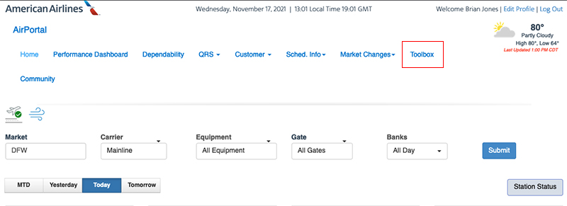
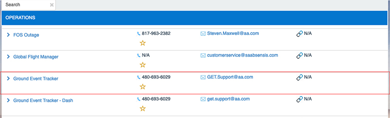
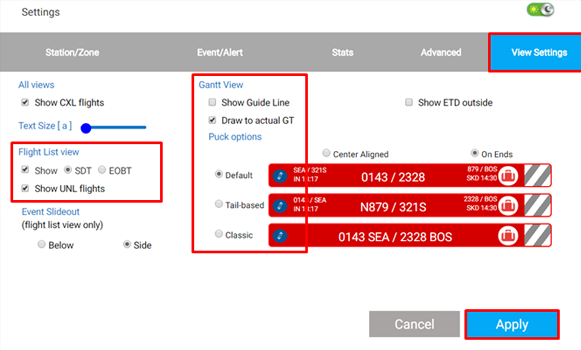

# Installing GET

1. Open your browser and enter getng.aa.com
2. Download GET as an application on your desktop
3. Navigate to the Operations tab of the Toolbox section of airportal.aa.com
4. Select Ground event tracker from the list and select install.

:::note
Contact your manager if you do not have the local permissions to install GET.
:::
5. Use this shortcut to launch GET in the future

Beneath the Dashboard is the flight display section. There are three different views you can select from:

