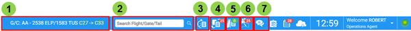
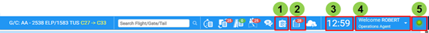
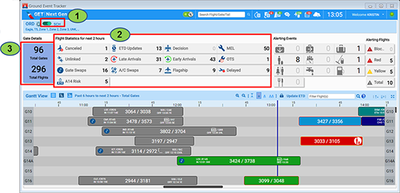
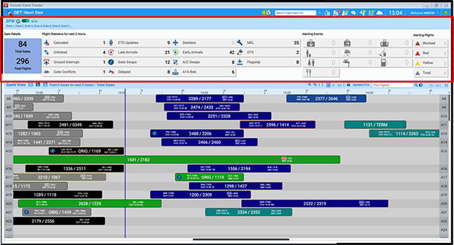
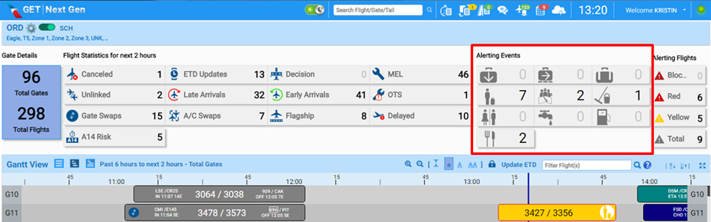
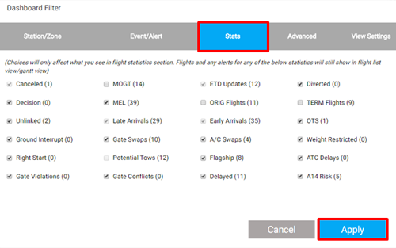
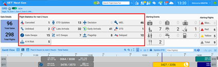
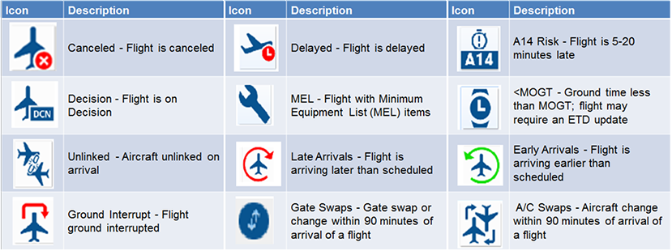
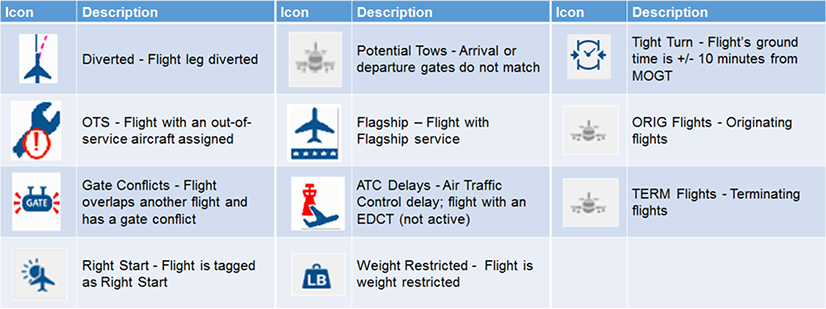
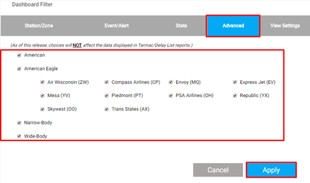

#Interface Basics

## Toolbar and Views

The first item displayed is the header or station alert line. This header includes a **search box, several icons, and other components.**

1. Latest changes
2. Search Box
3. Delay list
4. Swap Report
5. Tarmac Report
6. Crew Connection Report
7. Connect ME

## Station Tool Bar Components (continued)

1. Activity Log
2. Search box
3. Delay list
4. Swap Report
5. Data Indicator

Let’s explore how you can filter flight information using the Dashboard features.

1. Click the slider to view the flights that have already departed. Click it again to revert to the not departed list. This affects both the Dashboard and flight display - section that appears below the Dashboard.
2. Click any of the Flight Statistics to filter your list or Gantt chart accordingly.
3. To return to the full view, click the Gate Details box.
    

### Dashboard Filter Window

The Dashboard Filter window contains the following five tabs:

1. Station/Zone
2. Event/Alert
3. Stats
4. Advanced
5. View Settings

### Dashboard

Directly below the Station Tool Bar header is the Dashboard. The Dashboard displays the following:

- Gate Details
- Flight Statistics
- Alerting Events
- Alerting Flights

### Event/Alert: Icon Descriptions for Alerting Events

The Dashboard displays icons for Alerting Events.

:::note
Click the Alerting Events section of the Dashboard image to see descriptions of each icon.
:::

### Stats

:::note
The Stats tab allows you to select which Flight Statistics displays in the Dashboard section. Again, after making choices, click Apply.
:::

### Stat Icon Definitions

### Advanced Settings

The Advanced tab allows you to select the type of flights you wish to monitor. Use the check boxes next to each category to filter flights. For example, deselecting the American Eagle check box removes all American Eagle flights from the view. Again, after making choices, click Apply.

