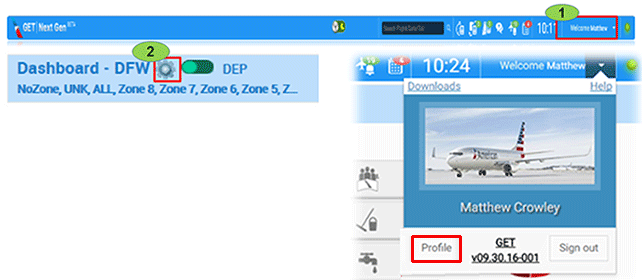
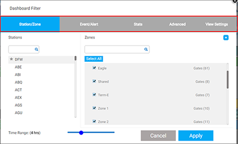

# hello Getpress Docs

## Personalizing GET

---
The first time you log in to GET, you will find that all zones are selected, your time range is two hours, and the Hybrid view is selected. To modify this, you can personalize your profile settings.

There are two ways to modify your profile and personalize your **GET** settings:

1. From the header bar, click the drop-down arrow next to your name to access the Profile button.
OR
2. From the Dashboard, click the wheel or sprocket icon next to the station.

Select the gates you wish to add to your zone then click the Add button. You can control the order in which you display gates by using the Move Up/Down buttons.
Select a name for your zone and click Apply
> 

:::note
Don’t forget to click Apply after making choices.
:::