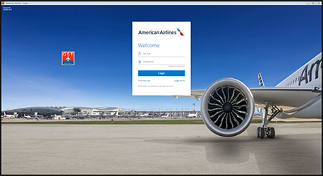
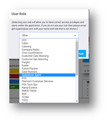

# Set Your User Roles

1. Sign in, entering your Jetnet username in the AA ID# field and your password in the Password field
2. Click Login
3. GET defaults to the home station

*After login, GET asks for your role. This information will be used at a later date to grant correct access.*