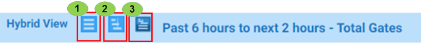
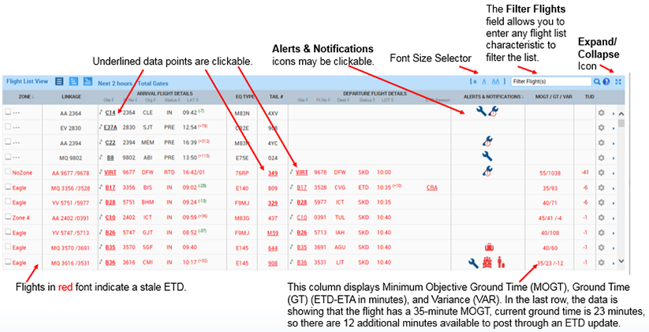

Beneath the Dashboard is the flight display section. There are three different views you can select from:
# View Settings

The View Settings tab allows you to select optional columns in the Flight List and select from three different Gantt Puck options.

## View Types

1. Flight List
2. Gantt
3. Hybrid

### Flight List View Set

